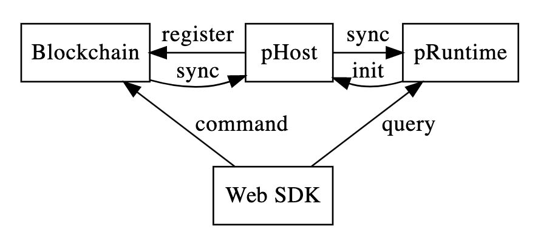

# Phala Blockchain


Phala Network is a TEE-Blockchain hybrid architecture implementing Confidential Contract. This repo
includes:

- `node/`: the main blockchain built on Substrate
- `phost/`: the bridge daemon to connect the blockchain and pRuntime
- `pruntime/`: the contract execution kernel running inside TEE enclave

## Overview



The **blockchain** is the central compoent of the system. It records commands (confidential contract
invocation), serve as the pRuntime registray, runs the native token and on-chain governance modules.

**pHost** is a daemon program that connects the blockchain and the pRuntime. It passes the block
data from the chain to pRuntime and passes pRuntime side effects back to the chain.

**pRuntime** (Phala Network TEE Runtime) is a runtime to execute confidential smart contracts, based on Intel SGX.

Related repos:

- [phala-docs](https://github.com/Phala-Network/phala-docs): The central repo for documentations.
- [phala-polka-apps](https://github.com/Phala-Network/phala-polka-apps): The Web UI and SDK to
  interact with confidential contract. Based on polkadot.js.
- [plibra-grant-docker](https://github.com/Phala-Network/plibra-grant-docker): The W3F M2 docker
  build with the blockchain, pHost and pRuntime.

### File structure

```text
.
├── LICENSE
├── README.md
├── pallets
│   └── phala                 Phala pallet
├── ring                      Patched ring with wasm support
├── scripts
│   ├── console.sh            Helper script to build & run the blockchain
│   └── init.sh
└───standalone
    ├── node                  Blockchain node
    ├── phost                 pHost, the bridge deamon
    ├── pruntime              pRuntime, the TEE kernel
    └── runtime               Phala Substrate Runtime
```

## Docker build

Plase refer to [plibra-grant-docker](https://github.com/Phala-Network/plibra-grant-docker). It includes both the blockchain and pRuntime.

## Native Build

### Dependencies

<details><summary>Expand</summary>

- Rust

  ```bash
  curl https://sh.rustup.rs -sSf | sh
  ```

- Substrate dependecies:

   ```bash
   git submodule init
   git submodule update
   sh ./scripts/init.sh
   ```

- LLVM 10

  ```bash
  wget https://apt.llvm.org/llvm.sh
  chmod +x llvm.sh
  ./llvm.sh 10
  ```

</details>

### Build the blockchain and bridge

Make sure you have Rust and LLVM-10 installed.

> Note for Mac users: you also need `llvm` and `binutils` from Homebrew or MacPort, and to add their binaries to your $PATH

```bash
cargo build --release
```

The build script enforces LLVM-9 or newer is used. LLVM-9 is needed because of the wasm port of rust
crypto library, `ring`. We have to compile the C code into wasm while keeping the compatibility with
the _current_ rustc.

## Run

1. Launch two local dev nodes Alice and Bob:

    ```bash
    ./scripts/console.sh start alice
    ./scripts/console.sh start bob
    ```

    - The datadir is at `$HOME/tmp/(alice|bob)`
    - Can be purged by `./scripts/console.sh purge`
    - The WebUI can connect to Alice at port 9944.

2. Compile & launch pRuntime

    ```bash
    cd standalone/pruntime
    git submodule init
    git submodule update
    ```

    Read `docs/sgx.md`, `Install SDK` section, to determine how to install the Intel SGX PSW & SDK.
    If not using Docker, you may need the following final steps:
    ```bash
    sudo mkdir /opt/intel
    sudo ln -s /opt/sgxsdk /opt/intel/sgxsdk
    ```

    Run `make` (`SGX_MODE=SW make` for simulation mode if you don't have the hardware).

    Apply for Remote Attestation API keys at
    [Intel IAS service](https://api.portal.trustedservices.intel.com/EPID-attestation). The SPID must be linkable. Then put the hex
    key in plain text files (`spid.txt` and `key.txt`) and put them into `bin/`.

    Finally, run pRuntime:
    ```bash
    cd bin/
    LD_LIBRARY_PATH=/opt/sgxsdk/lib64/ ./app
    ```

3. Run pHost (node and pRuntime required):

    ```bash
    ./target/release/phost
    ```

4. Use the WebUI

    Clone the
    [Experimental Apps for Phala Network](https://github.com/Phala-Network/apps-ng) repository and
read its documentation to build and run the WebUI.


## Run with tmuxp

You can launch the full stack (semi-automatically) by:

```bash
tmuxp load ./scripts/tmuxp/three-nodes.yaml
```

Or a 4-node testnet-poc2 setup:

```bash
CHAIN=poc2 tmuxp load ./scripts/tmuxp/four-nodes.yaml
```

[tmuxp](https://tmuxp.git-pull.com/en/latest/) is a convinient tool that can bring up a tmux session
with the preconfigured commands running in panes. To play with tmuxp, it also need a tmux installed.
