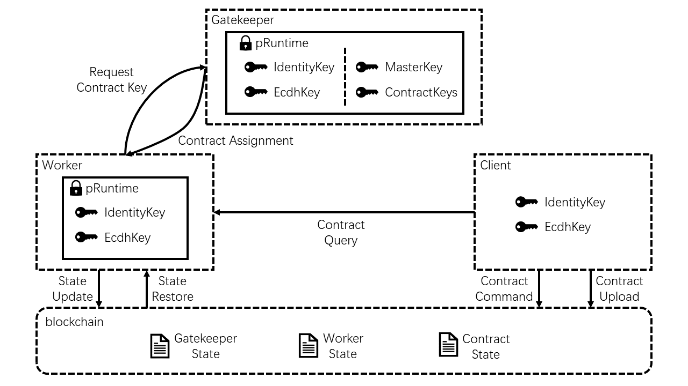

# Phala Blockchain


Phala Network is a blockchain-based confidential computing cloud. This repo includes:

- `node/`: the main blockchain built on Substrate
- `standalone/pherry/`: the message relayer to connect the blockchain and pRuntime
- `standalone/pruntime/`: the contract execution kernel running inside TEE enclave

## Overview



The **blockchain** is the central component of the system. It records commands (confidential contract invocation), serves as the pRuntime registry, runs the native token and on-chain governance modules.

**pherry** is the message relayer. It connects the blockchain and pRuntime. It passes the block data from the chain to pRuntime and passes pRuntime side effects back to the chain. A multi-client version of the runtime bridge is being developed [here](https://github.com/Phala-Network/runtime-bridge) and now in alpha version.

**pRuntime** (Phala Network Secure Enclave Runtime) is a runtime to execute confidential smart contracts, based on confidential computing.

## Native Build

### Dependencies

<details><summary>Expand</summary>

- Rust

  ```bash
  curl https://sh.rustup.rs -sSf | sh
  ```

- Substrate dependencies:

   ```bash
   git submodule update --init
   sh ./scripts/init.sh
   ```

- LLVM 10

  ```bash
  wget https://apt.llvm.org/llvm.sh
  chmod +x llvm.sh
  ./llvm.sh 10
  ```

</details>

### Build the blockchain and bridge

Make sure you have Rust and LLVM-10 installed.

> Note for Mac users: you also need `llvm` and `binutils` from Homebrew or MacPort, and to add their binaries to your $PATH

```bash
cargo build --release
```

The build script enforces LLVM-10 or newer is used. LLVM-10 is needed because of the wasm port of rust
crypto library, `ring`. We have to compile the C code into wasm while keeping the compatibility with
the _current_ rustc.

## Run

1. Launch a dev node:

    ```bash
    ./target/release/phala-node --dev
    ```

    - Can be purged by `./target/release/phala-node purge-chain <args like --dev>`
    - The [Polkadot.js UI](https://polkadot.js.org/apps) can connect to the node at port 9944.

2. Compile & launch pRuntime (Simulation mode)
    ```bash
    cd standalone/pruntime
    mkdir -p data
    cargo run
    ```

3. Compile & launch pRuntime (Hardware mode)

    Apply for Remote Attestation API keys at
    [Intel IAS service](https://api.portal.trustedservices.intel.com/EPID-attestation). The SPID must be linkable.

    Follow gramine's [document](https://gramine.readthedocs.io/en/latest/quickstart.html) to install the gramine toolchain.

    After installing the toolchain, you can graminify and run the pRuntime.
    ```bash
    export SGX_SIGNER_KEY=path/to/your/key.pem
    export IAS_SPID=your_spid
    export IAS_API_KEY=your_api_key_in_hex
    cd standalone/pruntime/gramine-build
    make
    gramine-sgx pruntime
    ```

4. Run pherry (node and pRuntime required):

    ```bash
    ./target/release/pherry --dev --no-wait
    ```

5. Web UI (TODO: still being refactored)

## Sub-pages

- [RPC](./docs/rpc.md): RPC documentations
- [Test](./docs/test.md): How to test the components

## External Resources

- [phala-wiki](https://github.com/Phala-Network/phala-wiki): The technical documentation.
- [phala-docker](https://github.com/Phala-Network/phala-docker): The production dockerfiles, including the blockchain, pherry, and pRuntime.
- [Code Bounty Program](https://forum.phala.network/t/topic/2045)
- [Responsible Disclosure](./docs/responsible-disclosure.md)
