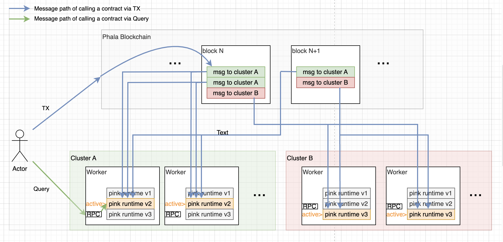
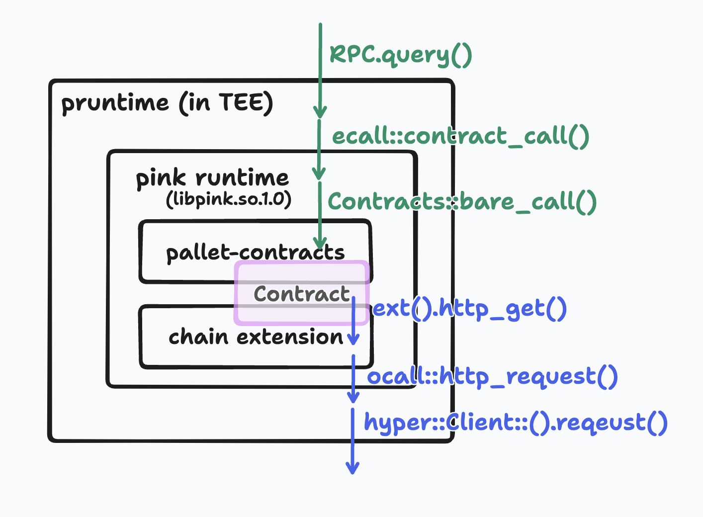
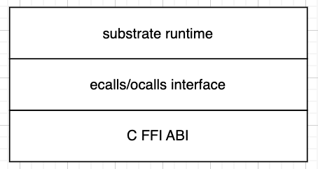

# Pink Runtime

This crate provides the runtime for Phala's `ink!` smart contracts.

## System Architecture



The system architecture comprises two main components: the chain and the worker. Inside the worker, Pink Runtime is operational. Messages from end-users reach Pink Runtime via one of two routes: on-chain transactions or off-chain RPC queries.

The following diagram illustrates the typical flow of a query:


## The dylib Interface

Upon receiving a user's message through a transaction or query, the worker decrypts the message and hands it off to Pink Runtime through the dylib interface.

From the interface point of view, the layers in Pink Runtime looks like this:



The interface consists of two layers:

### Low-level ABI Layer

This layer's types are described in the C header file at [`capi/src/v1/types.h`](../capi/src/v1/types.h).
The Pink Runtime exposes a single public function, `__pink_runtime_init`, which initializes the runtime and turns the dylib handle into a singleton instance for future use. The worker employs `dlopen` for loading Pink Runtime dylib and calls `__pink_runtime_init`. The `__pink_runtime_init` function accepts two parameters:

-   `config`: Contains the runtime configuration, primarily the ocall function pointers that enable the runtime to invoke host functions.
-   `ecalls`: An output parameter to which the runtime assigns the ecall function pointers, allowing the worker to invoke runtime functions through these pointers.

After initialization, the worker interacts with runtime functions using the ecall function pointers. The cross-call ABI is defined as follows:

```c
typedef void (*output_fn_t)(void *ctx, const uint8_t *data, size_t len);
typedef void (*cross_call_fn_t)(uint32_t call_id, const uint8_t *data, size_t len, void *ctx, output_fn_t output);
```

Each call is distinct by a unique call_id and accompanied by a data buffer. The calls also include an output function employed by the callee to relay output data.

The data for both input and output is used by the ecalls/ocalls layer to serialize or deserialize the information.

### ecalls/ocalls Layer

These interfaces are detailed in Rust [here](../capi/src/v1/mod.rs). This layer uses the #[cross_call] procedural macro, which can decorate a trait declaration with ecall/ocall function declarations. The macro will output an implementation of the trait that the caller can use, as well as a dispatch function on the callee's side.

For instance, a trait declaration like this:

```rust
#[cross_call(Impl)]
pub trait ECalls {
    fn foo(&self, p0: u8, p1: u8) -> u32;
    fn bar(&mut self, id: Hash) -> bool;
}
```

...would result in the following code:

```rust
pub trait ECalls {
    fn foo(&self, p0: u8, p1: u8) -> u32;
    fn bar(&mut self, id: Hash) -> bool;
}
impl<T: Impl + CrossCallMut> ECalls for T {
    fn foo(&self, p0: u8, p1: u8) -> u32 {
        let inputs = (p0, p1);
        let ret = self.cross_call(1, &inputs.encode());
        Decode::decode(&mut &ret[..]).expect("Decode failed")
    }
    fn bar(&mut self, id: Hash) -> bool {
        let inputs = (id);
        let ret = self.cross_call_mut(2, &inputs.encode());
        Decode::decode(&mut &ret[..]).expect("Decode failed")
    }
}
pub trait ECallsRo {
    fn foo(&self, p0: u8, p1: u8) -> u32;
}
impl<T: Impl> ECallsRo for T {
    fn foo(&self, p0: u8, p1: u8) -> u32 {
        let inputs = (p0, p1);
        let ret = self.cross_call(1, &inputs.encode());
        Decode::decode(&mut &ret[..]).expect("Decode failed")
    }
}
pub fn dispatch(
    executor: &mut (impl Executing + ?Sized),
    srv: &mut (impl ECalls + ?Sized),
    id: u32,
    input: &[u8],
) -> Vec<u8> {
    match id {
        1 => {
            let (p0, p1) = Decode::decode(&mut &input[..]).expect("Failed to decode args");
            executor.execute(move || srv.foo(p0, p1)).encode()
        }
        2 => {
            let (id) = Decode::decode(&mut &input[..]).expect("Failed to decode args");
            executor.execute_mut(move || srv.bar(id)).encode()
        }
        _ => panic!("Unknown call id {}", id),
    }
}
```

### Mutability in ecalls

The first parameter in each ecall function is either `&self` or `&mut self`, indicating whether the ecall is read-only (`&self`) or read-write (`&mut self`). Changes made during a read-only ecall get discarded once the ecall concludes.

## Substrate Runtime

At the heart of Pink Runtime is the Substrate runtime, which includes pallet-contracts along with other pallets. A chain extension incorporates Phala-specific implementations. The composition of the runtime takes place in [`src/runtime.rs`](src/runtime.rs), with the majority following the standard Substrate codebase. The critical segment is the chain extension, where Phala's unique functionalities are introduced at [`src/runtime/extension.rs`](src/runtime/extension.rs).
