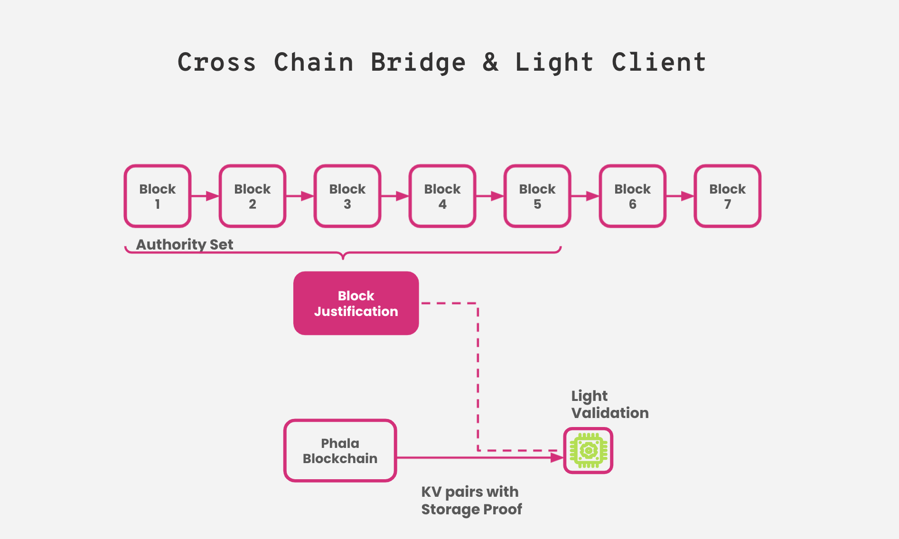

# Relayer

The relayer is responsible to sync data between the blockchain and pRuntime.

Now we have two relayer implementations:

- [pherry](../standalone/pherry): the legacy relayer written in Rust, based on subxt
- [runtime-bridge](https://github.com/Phala-Network/runtime-bridge) (prb): the next generation relayer written in Javascript, based on polkadot.js

The code pointers in this doc are based on `pherry`.

## Blockchain -> Enclave Sync

The relayer subscribes the blockchain, and sync new blocks (and the corresponding events and chain state) to `pRuntime`.

However, all the data received by `pRuntime` must be validated. The secure enclave is supposed to be a trusted environment, but the relayer is not, because anyone controlling the relayer can modify or manipulate the data before it enters `pRuntime`. So besides the block data, we have to prove the ingested data is valid and finalized to `pRuntime`.

As a result, there are two streams to sync the block data:

1. Block header stream
2. Block data stream

### Headers and Block Finalization

`pRuntime` tracks the finalized block header sequentially. Whenever a new block is finalized, the relayer should submit the new block headers to `pRuntime`.

Substrate (with Grandpa consensus) is friendly to light clients. The finalized blocks can come with justifications in a [SignedBlock](https://substrate.dev/rustdocs/v3.0.0-monthly-2021-05/sp_runtime/generic/struct.SignedBlock.html#structfield.justifications). The justification is the proof of block finalization.

The pRuntime api `sync_header` accepts a sequence of block headers, and it requires the block justification for the last block to ensure the submitted blocks are finalized.

### Validator Set and Authority Change

Block justifications can be validated with the current list of validator public keys (also called _validator set_ or _authority set_). 

From the genesis block, the validator set is a constant defined in the genesis block state. But after the genesis block, the validator set is rotated every [era](https://wiki.polkadot.network/docs/en/glossary#era). This process is also called _authority change_. In such case, the new validator set for the next era can be read from the last block in the current era.

The relayer is responsible to get the initial validator set and the following authority changes, and keep `pRuntime` in sync.

> - [Code: get the initial validator set](https://github.com/Phala-Network/phala-blockchain/blob/6da6386026fc240d8be3c43d3b0375d3bd2f7071/standalone/pherry/src/main.rs#L480)
> - [Code: get authority change]((https://github.com/Phala-Network/phala-blockchain/blob/6da6386026fc240d8be3c43d3b0375d3bd2f7071/standalone/pherry/src/main.rs#L389-L394))

Because the validator set rotation in every era, the relayer can only sync the block headers up to the last block in the current era to `pRuntime`. The sequence of syncing must follow:

1. Init `pRuntime` with the genesis validator set
2. Sync block headers in era 0
3. `pRuntime` applies the authority change at the last block of era 0
4. Sync block headers in era 1
5. `pRuntime` applies the authority change at the last block of era 1
6. ...

### Block Header Stream

Init `pRuntime`

- [init_runtime()](https://github.com/Phala-Network/phala-blockchain/blob/6da6386026fc240d8be3c43d3b0375d3bd2f7071/standalone/pherry/src/main.rs#L475)
    - [get_authority_with_proof_at()](https://github.com/Phala-Network/phala-blockchain/blob/6da6386026fc240d8be3c43d3b0375d3bd2f7071/standalone/pherry/src/main.rs#L480)
    - [call pruntime "init_runtime"](https://github.com/Phala-Network/phala-blockchain/blob/6da6386026fc240d8be3c43d3b0375d3bd2f7071/standalone/pherry/src/main.rs#L501-L505)

Sync block headers

- bridge()
    - [download new block headers](https://github.com/Phala-Network/phala-blockchain/blob/6da6386026fc240d8be3c43d3b0375d3bd2f7071/standalone/pherry/src/main.rs#L695-L707)
    - [batch_sync_block()](https://github.com/Phala-Network/phala-blockchain/blob/6da6386026fc240d8be3c43d3b0375d3bd2f7071/standalone/pherry/src/main.rs#L318-L402) (partial)
        - [get_authority_with_proof_at()](https://github.com/Phala-Network/phala-blockchain/blob/6da6386026fc240d8be3c43d3b0375d3bd2f7071/standalone/pherry/src/main.rs#L392)
        - [req_sync_header](https://github.com/Phala-Network/phala-blockchain/blob/6da6386026fc240d8be3c43d3b0375d3bd2f7071/standalone/pherry/src/main.rs#L401)
            - [call pruntime "sync_header"](https://github.com/Phala-Network/phala-blockchain/blob/6da6386026fc240d8be3c43d3b0375d3bd2f7071/standalone/pherry/src/main.rs#L224)

Handle block headers and authority changes (in `pRuntime`)

- [sync_header()](https://github.com/Phala-Network/phala-blockchain/blob/ab8f0c7e16b4aa679370c6ef8cb2e2ec08c820c7/standalone/pruntime/enclave/src/lib.rs#L1246)
    - [submit_finalized_headers()](https://github.com/Phala-Network/phala-blockchain/blob/ab8f0c7e16b4aa679370c6ef8cb2e2ec08c820c7/standalone/pruntime/enclave/src/lib.rs#L1289)
        - [verify_grandpa_proof()](https://github.com/Phala-Network/phala-blockchain/blob/ab8f0c7e16b4aa679370c6ef8cb2e2ec08c820c7/standalone/pruntime/enclave/src/light_validation/mod.rs#L165)
        - [check_validator_set_proof()](https://github.com/Phala-Network/phala-blockchain/blob/ab8f0c7e16b4aa679370c6ef8cb2e2ec08c820c7/standalone/pruntime/enclave/src/light_validation/mod.rs#L183): The validator set proof can be a StorageProof, or if we have the full state trie, validating the state root is sufficient as well.

## Enclave -> Blockchain Sync

WIP